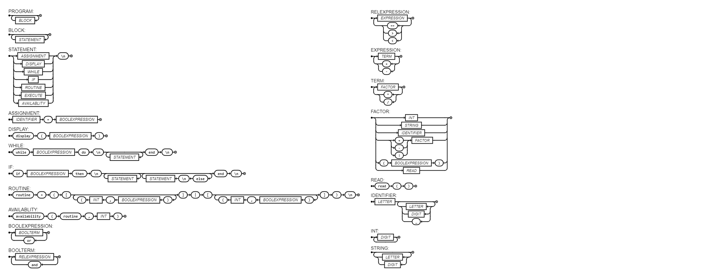

# Routin

Routin is a programming language designed to help users create habits and build a solid routine.

<p align="center">
  
</p>


* #### [EBNF](#EBNF)
* #### [Flex & Bison](#Flex-&-Bison)

#### <a name="EBNF">EBNF</a> 


```python
PROGRAM = { BLOCK };
BLOCK = { STATEMENT };
STATEMENT = (ASSIGNMENT | VARIABLE_DECLARATION | DISPLAY | WHILE | IF | ROUTINE | AVAILABLITY), "\n";

ASSIGNMENT = IDENTIFIER, "=", BOOLEXPRESSION;

VARIABLE_DECLARATION = "local", IDENTIFIER, [ "=", BOOLEXPRESSION ] ;

DISPLAY = "display", "(", BOOLEXPRESSION, ")";

WHILE           = "while", BOOLEXPRESSION, "do", "\n", {STATEMENT}, "end", "\n";

IF              = "if", BOOLEXPRESSION, "then", "\n", {STATEMENT}, ["else", "\n", {STATEMENT}], "end", "\n";

ROUTINE         = "routine", IDENTIFIER, ["=", "(", "[", { ")",BOOLEXPRESSION, ",", INT, "("},"]", "|", "[", { ")",INT, "-", INT, "("}, "]", ")"], "\n";


AVAILABLITY     = "availability", "(",IDENTIFIER, ",",INT, ")";

BOOLEXPRESSION  = BOOLTERM, {"or", BOOLTERM};
BOOLTERM        = RELEXPRESSION, {"and", RELEXPRESSION};
RELEXPRESSION   = EXPRESSION, {("==" | ">" | "<"), EXPRESSION};


EXPRESSION      = TERM, { ("+" | "-"), TERM};
TERM            = FACTOR, {("*" | "/"), FACTOR};
FACTOR          = INT | STRING | IDENTIFIER | (("+" | "-" | "!"), FACTOR) | "(", BOOLEXPRESSION, ")" | READ;
READ            = "read", "(", ")";
IDENTIFIER      = LETTER, {LETTER | DIGIT | "_"};
INT             = DIGIT, {DIGIT};

STRING          = {LETTER | DIGIT };
```




Routin is a programming language designed to help users create habits and build a solid routine. Some key points worth noting are:

* The hours of the day are represented as integers, ranging from 0 to 24, where 0 corresponds to the beginning of the day and 24 to the end (midnight).
* The time required to complete a task is also measured in hours. For example, specifying 1 would indicate a duration of 1 hour.
Here's an example of how to use it:


```python
# In the routine below, the user aims to spend 1 hour reading, 2 hours at the gym, and 4 hours studying.
# However, there are intervals where they cannot perform these tasks: from midnight to 6 in the morning,
# from 13:00 to 16:00, and from 21:00 to midnight. The software will organize the routine to accommodate these hour restrictions.
routine = (
  [("read book", 1), ("gym", 2), ("study", 4)] |
  [(0-6), (13-16), (21-24)])
```

```python
# Let's suppose one possible solution for this routine would be:
# 7-8   -> read book;
# 8-12  -> study;
# 17-18 -> gym;
# So the following code would display:

int i
while i < 25:
  if availability(routine, i):
    display(i)
  end
  i = i + 1
end

$19
$20
```

#### <a name="Flex-&-Bison">Flex & Bison</a> 

To test the Flex & Bison you can do:
```sh
flex scanner.l
bison -d parser.y
```

```sh
gcc lex.yy.c parser.tab.c -o parser -lfl
```

```sh
./parser < test_input.txt
```
